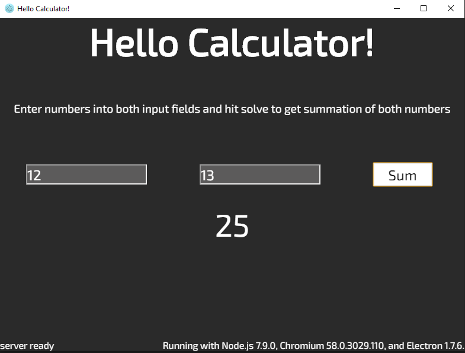

# Electron-Python

Electron GUI communicating with Python backend using zerorpc

### Create a python environments (with python3)
```bash
//for python3 environment
python -m venv env3
```

## Install dependencies for each virtual environment then exit
### Run python environments to install dependencies
It's important to deactivate virtual environments before running electron

Dependencies for python3 env
```bash
//env3 for Windows
source env3/Scripts/activate
//env3 macOS/Linux
source env3/bin/activate

pip install -r pycalc/requirements3.txt
```

## Ensure you are using the correct Node version with NVM
We will be using 7.9.0 version of Node,
Windows users download [NVM for Windows](https://github.com/coreybutler/nvm-windows/releases)

macOS install NVM using homebrew
if node is already installed delete it first
```bash
brew uninstall --ignore-dependencies node 
brew uninstall --force node


//Install NVM and refresh terminals path
wget -qO- https://raw.githubusercontent.com/nvm-sh/nvm/v0.35.2/install.sh | bash

source ~/.nvm/nvm.sh
```

NVM should now be installed
```bash
//to check if it is installed
nvm --version
```

## We will be using v7.9.0 of Node for this project
```bash 
nvm install 7.9.0

//to see list of Node versions you have installed
nvm list

// change node version
nvm use 7.9.0

verify version
node --version
```

Clear caches
On Window PowerShell
```powershell
Remove-Item "(env:USERPROFILE)\.node-gyp" -Force -Recurse -ErrorAction Ignore
Remove-Item "(env:USERPROFILE)\.electron-gyp" -Force -Recurse -ErrorAction Ignore
Remove-Item .\node_modules -Force -Recurse -ErrorAction Ignore
```

On Linux / OS X
```bash
rm -rf ~/.node-gyp
rm -rf ~/.electron-gyp
rm -rf ./node_modules
```

Install node_modules
```bash
npm install --runtime=electron --target=1.7.6
```

Set the environment variables
```bash
export npm_config_target=1.7.6 # electron version
export npm_config_runtime=electron
export npm_config_disturl=https://atom.io/download/electron
export npm_config_build_from_source=true

npm config ls
```

### Electron application will run now
```bash
./node_modules/.bin/electron .
//if dynamic linking error shows, clean caches and install node_modules again
```

### To run automated testing run:
```bash
npm test
```
